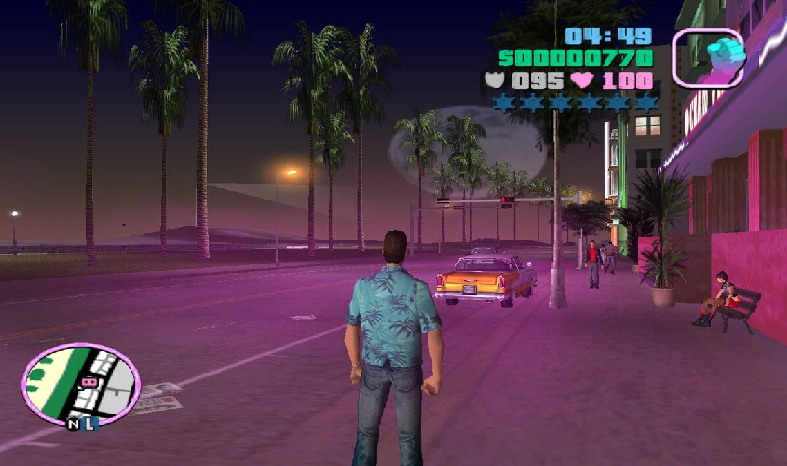
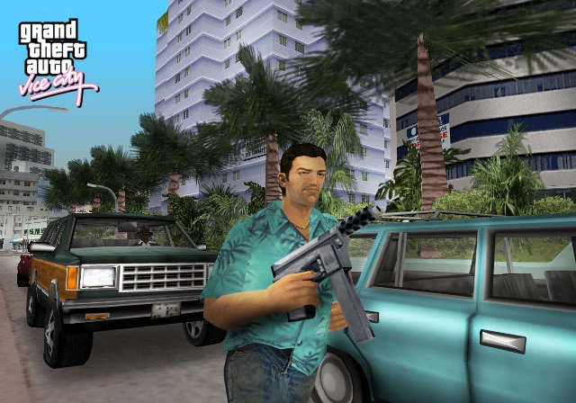
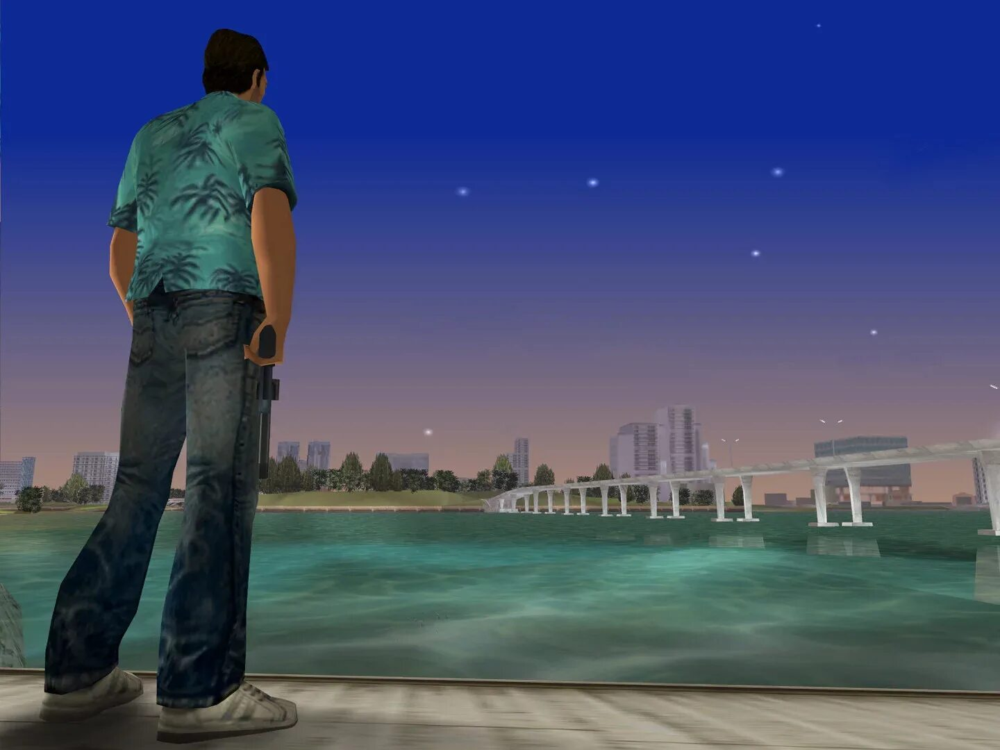

# Gta-Vice-Cite
Рассказ о гта вайс сити от Zer0code228
<html lang="ru">
<head>
    <meta charset="UTF-8">
    <meta name="viewport" content="width=device-width, initial-scale=1.0">
    <title>GTA Vice City — Официальный сайт</title>
    
</head>
<body>
    <header>
        <h1>GTA Vice City</h1>
        
Легендарная игра от Rockstar Games

    </header>
    <nav>
        <ul>
            <li><a href="#home">Главная</a></li>
            <li><a href="#about">Об игре</a></li>
            <li><a href="#cheats">Читы</a></li>
        </ul>
    </nav>
    <main>
        <section id="home">
            <h2>Добро пожаловать в Вайс-Сити!</h2>
            
GTA Vice City — культовая игра в жанре action‑adventure от третьего лица, выпущенная в 2002 году. Погрузитесь в атмосферу 1980‑х: неоновые огни, яркие автомобили, гламурный стиль и криминальные разборки в вымышленном городе Вайс‑Сити, вдохновлённом реальным Майами.

           

        </section>
        <section id="about">
            <h2>Об игре</h2>
            
<strong>Год выпуска:</strong> 2002 (PlayStation 2), 2003 (PC, Xbox)

            
<strong>Разработчик:</strong> Rockstar North

            
<strong>Издатель:</strong> Rockstar Games

            
<strong>Платформы:</strong> PC, PlayStation 2, Xbox, iOS, Android и др.

            
Сюжет разворачивается в 1986 году. Главный герой — Томми Версетти — выходит из тюрьмы и отправляется в Вайс‑Сити для заключения крупной сделки. Однако сделка срывается, и Томми вынужден строить собственную криминальную империю, чтобы выжить и вернуть утраченное.

            
Игра вдохновлена культовыми произведениями 1980‑х, такими как фильм «Лицо со шрамом» и сериал «Полиция Майами: Отдел нравов».

        </section>
        <section id="cheats">
            <h2>Популярные читы</h2>
            <ul>
                <li><strong>THUGSTYL</strong> — бесконечное здоровье (не защищает от взрывов и падений)</li>
                <li><strong>ASPIRINE</strong> — полное здоровье и броня</li>
                <li><strong>LEAVEMEALONE</strong> — убрать уровень розыска (звёзды полиции)</li>
                <li><strong>YOUWONTTAKEMEALIVE</strong> — максимальный уровень розыска (6 звёзд)</li>
                <li><strong>COMEFLYWITHME</strong> — летающие машины</li>
                <li><strong>FANNYMAGNET</strong> — все женщины следуют за вами</li>
                <li><strong>NOBODIESPERFECT</strong> — пули не пробивают машины</li>
            </ul>
            
<em>Внимание: использование читов может заблокировать получение достижений.</em>

        </section>
        <section>
            <h2>Скриншоты</h2>
            
            
            
        </section>
      <h2>Ссылка на википедию</h2>
      <a href="https://ru.wikipedia.org/wiki/Grand_Theft_Auto:_Vice_City">Википедия</a>
    </main>
    <footer>
        
&copy; 2026 GTA Vice City Fan Site. Все права защищены. Автор: Zer0code228

    </footer>
</body>
</html>
